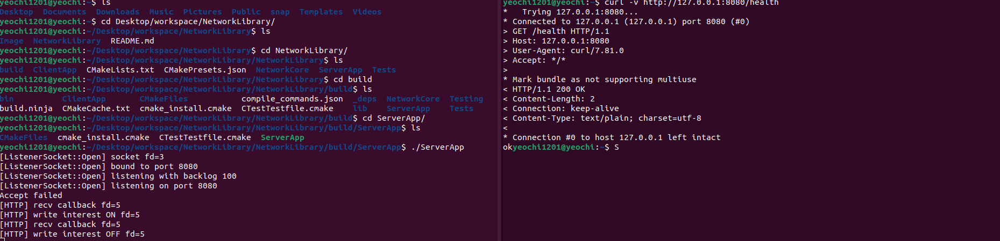
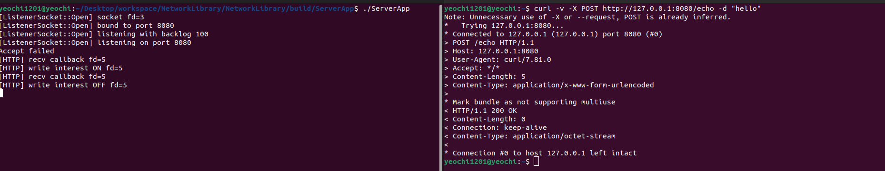
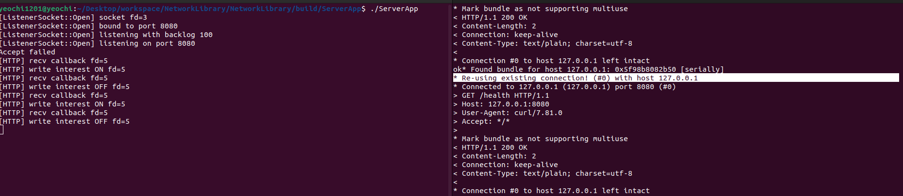

# Epoll-based HTTP Server

epoll 기반 비동기 네트워크 코어 위에  
TCP 스트림 환경에서도 안정적으로 동작하는 **HTTP/1.1 서버**를 구현한 프로젝트입니다.

본 프로젝트는 단순 기능 구현이 아니라,

- epoll 기반 비동기 I/O 구조
- RecvBuffer / SendBuffer 기반 버퍼 관리
- Incremental HTTP Parsing
- keep-alive 및 안전한 connection 종료

를 실제 동작으로 검증하는 것을 목표로 합니다.

---

## 🧩 Architecture Overview

- **Session**
  - socket I/O
  - RecvBuffer / SendBuffer
  - epoll event 처리

- **HttpParser**
  - Request-Line / Header / Body 상태 머신
  - Content-Length 기반 body 처리
  - keep-alive 환경에서 back-to-back 요청 지원

- **EpollServer**
  - fd → HttpConnState 관리
  - HTTP 라우팅 및 connection 정책 담당

---

## 🚀 Server Execution


epoll 기반 서버가 정상적으로 기동되며,
HTTP 요청을 수신할 준비가 된 상태입니다.

---

## ✅ Health Check Endpoint


```bash
curl -v http://127.0.0.1:8080/health
```

# 🔧 Build & Run
## ✅ Build Environment

OS: Linux (Ubuntu 20.04+ 권장)

Compiler: GCC / Clang (C++20 지원)

Build System: CMake

Test Framework: GoogleTest

⚠️ 본 프로젝트는 Linux epoll API를 사용하므로 Windows에서는 빌드되지 않습니다.

## ✅ Required Packages

Ubuntu 기준으로 아래 패키지를 먼저 설치한다.
```bash
sudo apt update
sudo apt install -y \
    build-essential \
    cmake \
    git
```

GoogleTest는 CMake에서 FetchContent 또는 서브모듈로 포함되어 있으므로
별도 설치가 필요 없습니다.

## ✅ Build Steps

프로젝트 루트 디렉터리에서 아래 순서대로 진행한다.

# 1. build 디렉터리 생성
```bash
mkdir -p build
cd build
```

# 2. CMake configure
```bash
cmake ..
```
# 3. Build
```bash
cmake --build . -j
```

빌드가 완료되면 실행 파일이 생성된다.


## ✅ Run Server
```bash
./ServerApp
```

정상 실행 시 다음과 유사한 로그를 확인할 수 있다.

epoll 서버 초기화

listening socket 생성

client accept 대기 상태

## ✅ HTTP Test (Runtime Verification)

서버 실행 후 다른 터미널에서 다음 명령으로 동작을 확인할 수 있다.

Health Check

```bash
curl -v http://127.0.0.1:8080/health
```

Echo (POST)

```bash
curl -v -X POST http://127.0.0.1:8080/echo -d "hello"
```

Keep-Alive Test'

```bash
curl -v --http1.1 \
  http://127.0.0.1:8080/health \
  http://127.0.0.1:8080/health
```

## ✅ Run Unit Tests

빌드 디렉터리에서 테스트를 실행한다.

ctest


또는 테스트 바이너리를 직접 실행할 수도 있다.

./NetworkCoreTests


테스트는 다음 항목을 검증한다.

1. HttpParser 분할 수신 처리

2. back-to-back HTTP 요청 파싱

3. RecvBuffer / SendBuffer 정합성

4. Message Framing 및 부분 소비 시나리오

## 🛠 Troubleshooting (Build)
### ❗ epoll 관련 컴파일 에러

Linux가 아닌 환경에서 빌드 시 발생

WSL2 또는 Ubuntu 환경에서 빌드 필요

### ❗ C++20 관련 에러

GCC 9 이상 권장

CMakeLists.txt에서 CXX_STANDARD 20 설정 확인

## 📌 Build Summary

CMake 기반 단일 빌드 흐름

별도 스크립트 없이 표준 build 디렉터리 사용

서버 실행 + HTTP 동작 + 단위 테스트까지 일관된 흐름 제공
